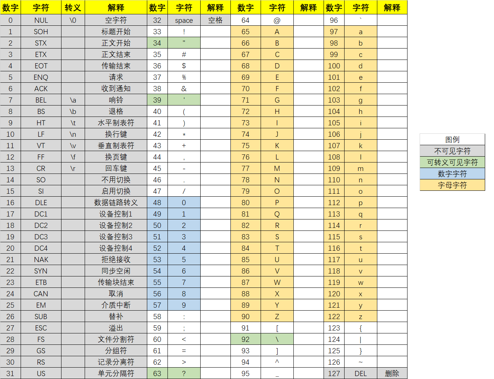

**关键字：**在这门计算机语言中，已经被语言使用的字段。

**字节：**8位二进制作为一个字节，是计算机管理内存空间的最小单位。

**变量名的命名规则：**

 1、由字母、数字、下划线构成。

 2、不能由数字开头。

 3、不能跟关键字完全相同。

**补码：**存储负数时，采用原码直接计算会导致计算出错，所以诞生了补码。

**补码的计算：**先用短除算出原码，然后求出反码，方法是符号位不变，其他位取反（0变1，1变0）。随后给结果加1，即可求出补码。

正数的原反补码不存在区别。

**整数类型的长度：**通常char、short、int、long、long long分别占用1、2、4、4、8字节，一定遵循long long ≥ long ≥ int ≥ short的规律

**浮点型类型的长度：**float、double分别占用4、8字节。

**%f、%lf：**float和double在scanf和printf中使用%f和%lf输入和输出。

**打印精度：**printf在打印时可以在占位符%和类型说明符f间插入.n表示保留n位小数，例如%.2f是保留两位小数

**sizeof：**sizeof后的小括号中可以放入变量名或类型名，来求出该变量或该类型在内存中所占字节数。

**不同数据类型间的变量进行混合运算，遵循以下原则**：

 整型向浮点型看齐。

 短类型向长类型看齐。

 有符号向无符号看齐。

**截断**：字节数较多的整型变量赋值给字节数较少的整形变量，高位会截断丢弃，从而使得数字信息部分丢失，所以尽量不要这样做。

**字符型**：char类型除了是单字节整型外，还兼任字符型。

**%c**：printf、scanf使用%c对字符进行输入输出。

**getchar、putchar**：字符专属的输入输出，使用方式为：

```c
char a = getchar();
putchar(a);
```

**AscII码**：一种英文字符的编码方式

**AscII码表**：


**字符常量**：可以用单引号引出一个字符，赋给字符变量。本质其实是将该字符的AscII码值付给了字符变量。

单引号引起来的字符常量是字符型，而数字属于整型。

可见字符和不可见字符间的分界线为空格。

数字字符转换成数字只需要减48，即减‘0’（字符0）。

大小写字母之间互相转换只需要加减32，即减‘a’-‘A’。

**printf的类型描述符**：


**常量类型表**：


**运算符**：表示让语言执行指定运算的符号

**运算符学习方法**：

1、目数

2、表达式的值

3、前后限制

**表达式**：运算符找到了所有的小伙伴，就构成了一个表达式。表达式的运算结果就是表达式的值。

**算术运算符**：进行基础算术运算的+、-、*、/、%(mod，取余数)、++、--

**++、--**：单目运算符，出现在变量之前，表达式的值为运算后的结果，出现在变量后，表达式的值为运算前的结果。但是无论在前还是在后，都会使得被作用的变量自增1或自减1。

**赋值运算符**：=可以将等号右边的值赋值给等号左边。

**左值和右值**：在双目运算符左边的值为左值，右边的值为右值。

**赋值运算符可以跟五个双目的算术运算符和五个双目的位运算符结合**，规则为：a += 2相当于a = a + 2，b /= 3相当于b = b / 3，以此类推。表达式的值为运算后的结果。

赋值运算符是唯一从右向左运算的双目运算符。

**比较运算符**： > 大于 < 小于 <= 小于等于 >= 大于等于 == 等于 != 不等于

**“真”和“假”**：0值为假，非0值为真。

**比较表达式**：表达式成立则值为“真”，否则为“假”。

**逻辑运算符**： | | 逻辑或， && 逻辑与，! 逻辑非。

**逻辑或**：任意一目为真，则表达式为真，否则为假　

**逻辑与**：两目同时为真，则表达式为真，否则为假

**逻辑非**：表达式为真则为假，表达式为假则为真

**逻辑运算符的短路**：如果逻辑运算符的左值已经可以确定整个逻辑运算符的结果，那么逻辑运算符的右值将不会被执行。

**条件运算符/条件表达式**：表达式1 ? 表达式2 : 表达式3

​                  当表达式1为真时，表达式的值为表达式2，否则为表达式3

条件运算符是C语言中唯一的三目运算符。所以也叫三目运算符。

**位运算符**：位与运算符&、位或运算符|、异或运算符^、取反运算符~、左移运算符<<，右移运算符>>

**位与**：按位取与，有0则0

**位或**：按位取或，有1则1

**异或**：按位异或，异1同0

**取反**：按位取反，01交换

**左移**：左值中所有的1向左移右值位

**右移**：左值中所有的1向右移右值位

左移或者右移会导致丢失1，这个过程是不可逆的。

**优先级表**：


